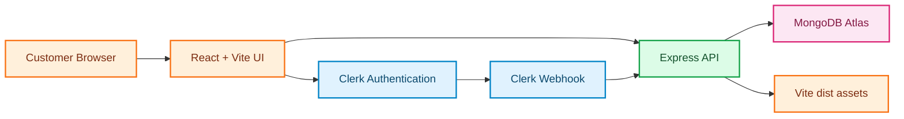
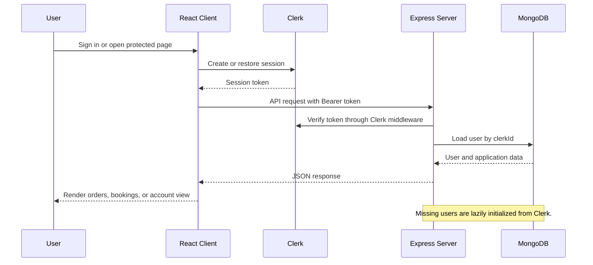
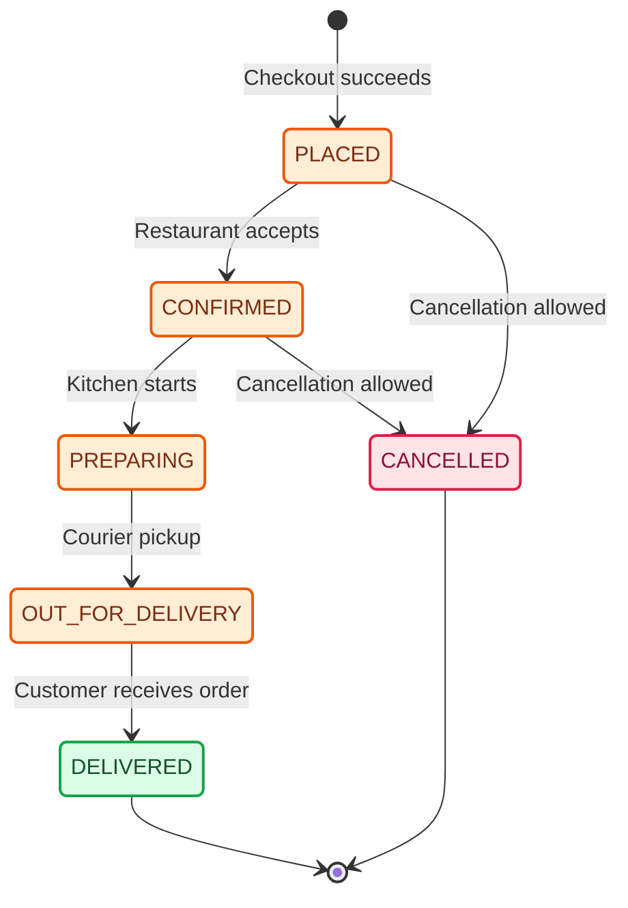
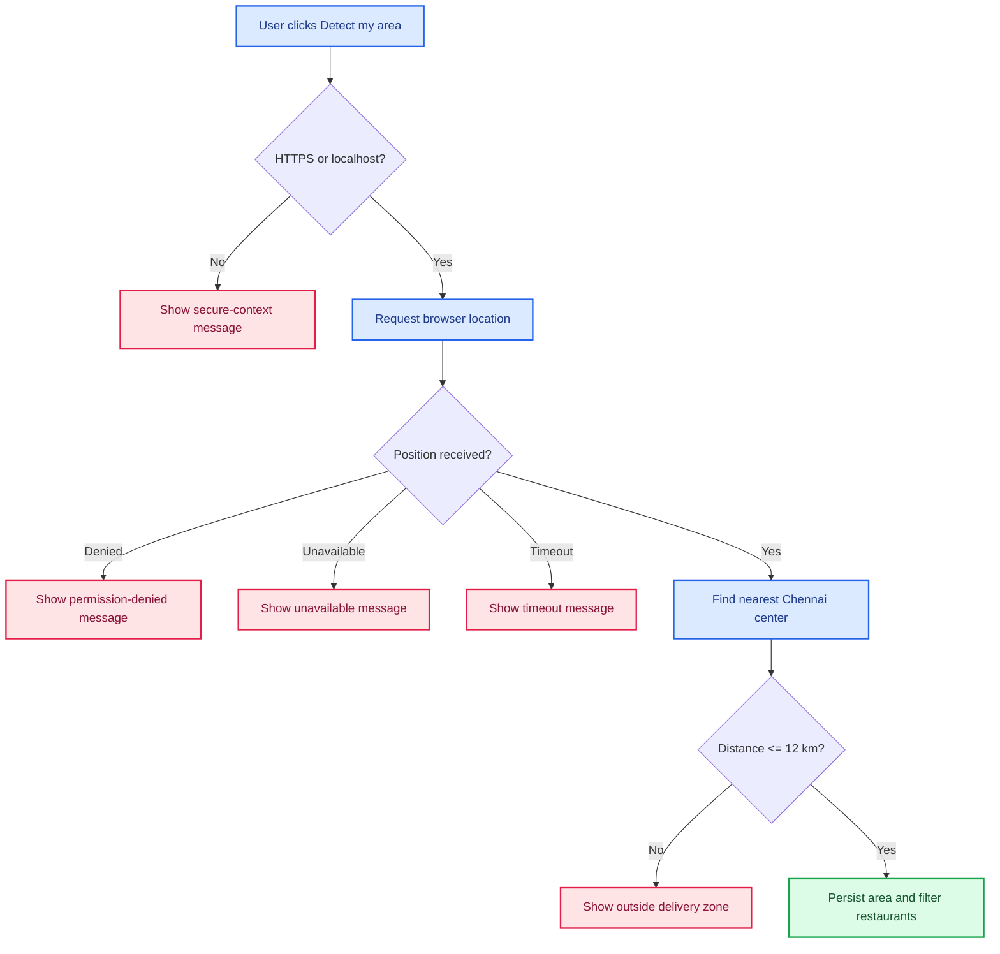

# CraveDrop

CraveDrop is a full-stack Chennai food ordering and table reservation application. Customers can discover local restaurants, detect their delivery area, browse menus, manage a cart, place orders, reserve tables, and review their order history. Staff can manage restaurants, menus, users, orders, and reservations through the admin area.

## Product Capabilities

- Restaurant discovery by area, search, cuisine, vegetarian preference, rating, delivery time, and cost.
- Browser-based Chennai area detection using device geolocation and nearest-center haversine distance.
- Manual area selection fallback for Ramapuram, Mogappair, Anna Nagar, T. Nagar, Velachery, Adyar, Besant Nagar, Mylapore, Porur, Kilpauk, and Nungambakkam.
- Cart management for one restaurant at a time.
- Checkout with saved or new delivery addresses, COD, and online-payment status handling.
- Table reservation creation and cancellation.
- Clerk authentication with customer and admin roles.
- MongoDB persistence for users, restaurants, menus, carts, orders, and bookings.
- Clerk webhooks for synchronizing user records.
- Responsive mobile, tablet, and desktop UI.

## Architecture



### Request and authentication flow



### Order lifecycle



## Technology Stack

| Layer | Technology |
|---|---|
| UI | React 19, React Router, Tailwind CSS 4, Lucide icons |
| Build | Vite 8, esbuild, TypeScript |
| Server | Node.js, Express, Clerk Express middleware |
| Authentication | Clerk React and Clerk webhooks |
| Database | MongoDB and MongoDB Atlas |
| Data fetching | TanStack React Query and Axios |
| Validation | Zod |
| State | Zustand |

## Requirements

- Node.js 22 or newer. `svix` currently requires Node 22.
- npm 10 or newer.
- MongoDB local instance or MongoDB Atlas.
- Clerk application for sign-in, protected routes, and webhooks.
- A modern browser for geolocation and Clerk authentication.

## Installation

```bash

cd cravedrop
npm install
```

Create a local environment file:

```bash
cp .env.example .env
```

On Windows PowerShell, use:

```powershell
Copy-Item .env.example .env
```

## Environment Variables

Set these values in `.env`. Never commit real secrets.

```env
NODE_ENV=development
PORT=3000
MONGODB_URI="mongodb://127.0.0.1:27017/food_booking"
CLERK_PUBLISHABLE_KEY="pk_test_..."
CLERK_SECRET_KEY="sk_test_..."
CLERK_WEBHOOK_SECRET="whsec_..."
VITE_CLERK_PUBLISHABLE_KEY="pk_test_..."
APP_URL="http://localhost:3000"
GEMINI_API_KEY=""
```

`VITE_CLERK_PUBLISHABLE_KEY` is read during the Vite build. The server uses `CLERK_SECRET_KEY` to verify protected requests. The `PORT` variable is supplied by most hosting providers and defaults to `3000` locally.

## Database Setup

Initialize required indexes and collections:

```bash
npm run init-db
```

Seed development data:

```bash
npm run seed
```

The seed script creates sample Chennai restaurants and menu items. Do not run it against production unless replacing the database contents is intentional.

## Running Locally

Start the development server:

```bash
npm run dev
```

Open [http://localhost:3000](http://localhost:3000).

The development server runs Express and Vite together. API requests are available under `/api`.

## Available Scripts

| Command | Purpose |
|---|---|
| `npm run dev` | Start Express with Vite middleware |
| `npm run build` | Build the frontend and bundle the production server |
| `npm start` | Run `dist/server.cjs` |
| `npm run lint` | Run TypeScript validation |
| `npm run test` | Run Jest tests |
| `npm run init-db` | Initialize database indexes and collections |
| `npm run seed` | Insert development restaurant and menu data |
| `npm run preview` | Preview the Vite frontend build |
| `npm run clean` | Remove generated build output |

## Authentication Setup

1. Create an application at the [Clerk Dashboard](https://dashboard.clerk.com).
2. Enable the desired sign-in methods.
3. Copy the publishable key into both `CLERK_PUBLISHABLE_KEY` and `VITE_CLERK_PUBLISHABLE_KEY`.
4. Copy the secret key into `CLERK_SECRET_KEY`.
5. Add the Clerk webhook endpoint:

```text
https://YOUR_DOMAIN/api/webhooks/clerk
```

6. Subscribe the webhook to `user.created`, `user.updated`, and `user.deleted`.
7. Copy the webhook signing secret into `CLERK_WEBHOOK_SECRET`.
8. Add public metadata to an administrator:

```json
{
   "role": "admin"
}
```

Customers can browse publicly. Clerk authentication is required for checkout, orders, bookings, profiles, and admin routes.

## Location Detection

Location detection is never triggered automatically. The user must click `Detect my area`.



The selected area is stored in `localStorage` under `cravedrop_selected_area`. If no area is selected, restaurants are loaded without an `area` filter. Once selected, requests use:

```text
GET /api/restaurants?area=Ramapuram
```

## Main Routes

### Frontend routes

| Route | Access | Purpose |
|---|---|---|
| `/` | Public | Restaurant discovery and filters |
| `/restaurant/:id` | Public | Restaurant menu and details |
| `/checkout` | Clerk user | Delivery address and order checkout |
| `/orders` | Clerk user | Order history and status |
| `/orders/:id` | Clerk user | Order details |
| `/bookings` | Clerk user | Table reservations |
| `/profile` | Clerk user | Profile and saved addresses |
| `/admin` | Admin | Operations dashboard |

### API routes

| Method | Endpoint | Access | Purpose |
|---|---|---|---|
| `GET` | `/api/health` | Public | MongoDB health and counts |
| `GET` | `/api/restaurants` | Public | Search and filter restaurants |
| `GET` | `/api/restaurants/:id/menu` | Public | Load restaurant menu |
| `GET` | `/api/restaurants/areas/list` | Public | List database areas |
| `POST` | `/api/cart` | Clerk user | Add or update cart |
| `GET` | `/api/cart` | Clerk user | Load active cart |
| `POST` | `/api/orders` | Clerk user | Create an order |
| `GET` | `/api/orders` | Clerk user | List current user orders |
| `GET` | `/api/orders/:id` | Clerk user | Read one owned order |
| `POST` | `/api/bookings` | Clerk user | Create a reservation |
| `GET` | `/api/bookings` | Clerk user | List current user reservations |
| `PATCH` | `/api/bookings/:id/cancel` | Clerk user | Cancel a reservation |
| `POST` | `/api/webhooks/clerk` | Clerk webhook | Synchronize Clerk users |

## Production Build and Deployment

Build and run locally in production mode:

```bash
npm run lint
npm run build
NODE_ENV=production npm start
```

The compiled server serves both the API and the Vite `dist` assets. It binds to `0.0.0.0` and uses `PORT` when supplied by the hosting provider.

### Render, Railway, or similar Node host

Use:

```text
Build command: npm install && npm run build
Start command: npm start
Node version: 22
```

Configure the production environment variables in the host dashboard. Set `APP_URL` to the HTTPS deployment URL and use production Clerk keys. Update the Clerk allowed origins and webhook URL to match the deployed domain.

### MongoDB Atlas production checklist

- Create a least-privilege database user.
- Use a dedicated production database.
- Configure network access for the hosting provider.
- Run `npm run init-db` against the production URI.
- Seed only when production data is intentionally being created or replaced.
- Enable backups and monitoring.

## Testing and Verification

Run checks before opening a pull request:

```bash
npm run lint
npm run build
npm test
```

Manual smoke test:

1. Open the home page as a guest.
2. Search for a restaurant or cuisine.
3. Detect or manually choose a Chennai area.
4. Open a restaurant and add a menu item to the cart.
5. Sign in with Clerk.
6. Complete checkout.
7. Confirm the order appears at `/orders`.
8. Create a reservation and confirm it appears at `/bookings`.
9. Cancel the reservation and confirm its status changes.
10. Verify an admin user can open `/admin`.

## Troubleshooting

### The app shows a sign-in prompt

Protected routes require a current Clerk session. Click the Clerk sign-in button and use the same account that created the order or reservation.

### Orders or bookings are empty

Confirm the user is signed in with the same Clerk account used to create them. Check that the API request includes a Bearer token and that MongoDB contains documents with that account’s `clerkId`.

### Location detection does not work

Browser geolocation requires HTTPS or `localhost`. Check browser permission settings and use the manual area search when location is unavailable.

### The server cannot connect to MongoDB

Check `MONGODB_URI`, database-user permissions, Atlas network access, and whether the local MongoDB service is running.

### The server port is already in use

Stop the process using port 3000 or choose another local port:

```powershell
$env:PORT=3001
npm run dev
```

### Clerk development-key warning

Development keys are expected locally. Use production Clerk keys and a production Clerk instance before deployment.

## Security Notes

- Do not commit `.env`, Clerk secrets, MongoDB credentials, or webhook secrets.
- Rotate any secret that has been exposed.
- Keep authorization checks on the server; client route guards are only a user experience layer.
- Orders and bookings are filtered by the authenticated MongoDB user ID.
- Webhook signatures must be verified before processing Clerk events.
- Use HTTPS in every deployed environment.

## Project Structure

```text
.
├── server.ts                 # Express and Vite entry point
├── server/
│   ├── db/                   # MongoDB connection and database helpers
│   ├── middleware/           # Clerk authentication and authorization
│   ├── routes/               # REST API route modules
│   ├── schemas/              # Zod request validation
│   └── utils/                # Backend helpers such as area resolution
├── src/
│   ├── components/           # Shared UI and domain components
│   ├── hooks/                # React Query and application hooks
│   ├── lib/                  # API client, stores, auth, and helpers
│   ├── pages/                # Route-level screens
│   ├── config/               # Areas, cuisines, and application constants
│   └── types/                # Shared frontend types
├── scripts/                  # Database initialization and seeding
├── data/                     # Local MongoDB data when using the bundled database
├── index.html                # Vite HTML entry point
├── package.json              # Scripts and dependencies
└── .env.example              # Environment variable template
```

## License and Contributions

Add the project license and contribution policy before publishing the repository publicly. For changes, keep commits focused, run lint and build, and include manual verification steps for customer-facing behavior.
